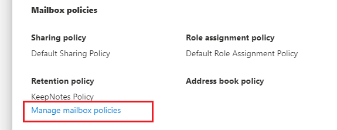
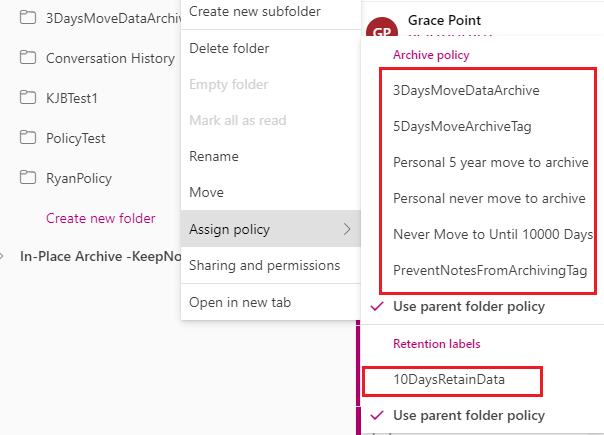
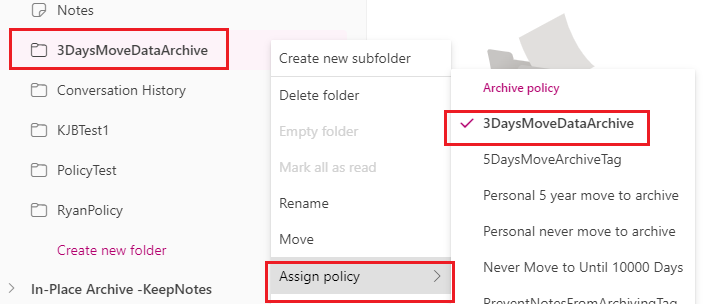
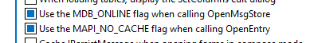
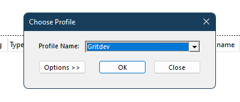
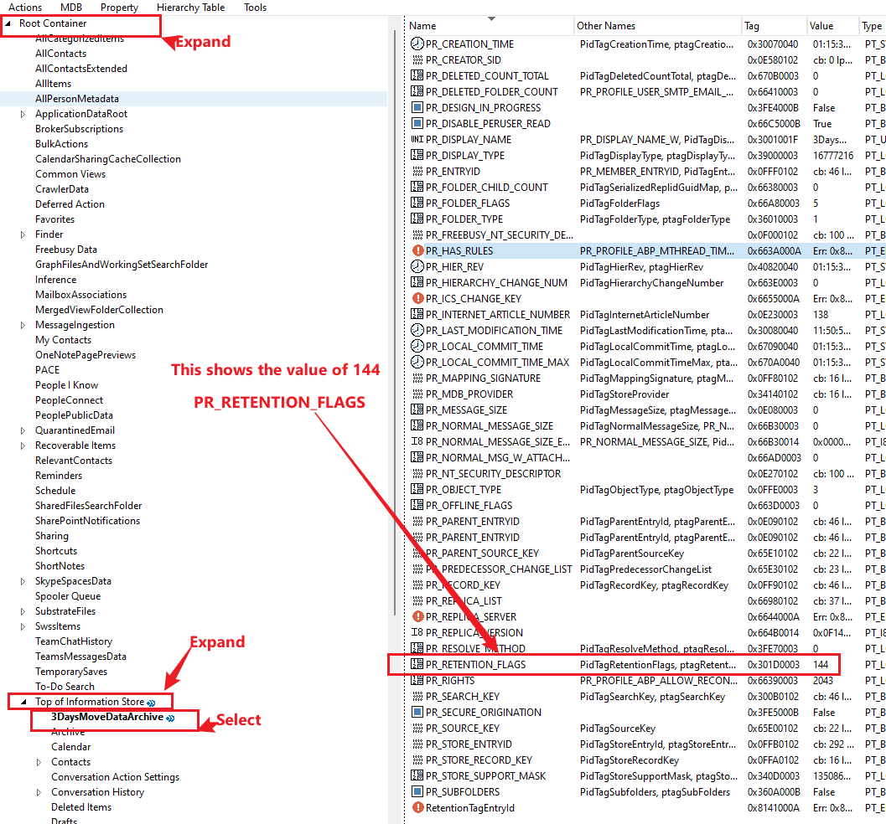

<style>

h2 {
    color: Yellow;
    font-weight:400;
    font-size: 20px;
}

h3 {
    color: Yellow;
    font-weight:400;
    font-size: 20px;
    text-transform: initial;
}

.notes {
    background-color: #342448;
    margin: 1.5em
}
.notesContent {
    color: bisque;
    margin: 2m
}

</style>

# Introduction

This program is designed of stamping specific folder in the user primary mailbox or online archive folder with retention or archive retention policy tag.

## Good finding

- Its not mandatory to add the tag you want to apply to folder in the list tags of the MRM Retention Policy assigned to the user account.

## Used Scenarios

- Prevent specific folder from moving to archive
- Move specify folder content to Online Archive Mailbox.

# Requirements

For the program to work as expected, the following modules and configuration are required.

- Due to the deprecation of <a href="https://learn.microsoft.com/en-us/exchange/clients-and-mobile-in-exchange-online/deprecation-of-basic-authentication-exchange-online">basic authentication</a> for exchange online, OAuth must be configured through Azure AD application
- Microsoft Exchange Online WebServices access. How to install EXO EWS Module: The <a href="https://github.com/officedev/ews-managed-api" target="_">EWS Managed API</a> <i>The program folder already contains the EWS the Module.</i>

- Install the <a href="https://www.powershellgallery.com/packages/MSAL.PS">MSAL.PS</a> module for EWS OAuth access
- Configure OAuth for EWS. For steps on how to configure. <a href="https://learn.microsoft.com/en-us/exchange/client-developer/exchange-web-services/how-to-authenticate-an-ews-application-by-using-oauth">Authenticate an EWS application by using OAuth | Microsoft Learn</a>
- Download the <a href="https://github.com/stephenegriffin/mfcmapi/releases" target="_">latest MFCMAPI release</a> from GitHub, it will be used get the critical program parameters such as <b style ="Color:red"> RetentionFlagsValue</b>

# Configuring Azure AD Application for EWS OAuth

To use OAuth, an application must have an application ID issued by Azure Active Directory. There you have do the following

- Register your application as a public client with Azure Active Directory.
- Configure for delegated authentication

## Register your application

<ol>
    <li>
        <p>Open a browser and navigate to the <a href="https://aad.portal.azure.com" target="_">Azure Active Directory admin center</a> <strong>Work or School Account</strong>.</p>
    </li>
    <li><p>Select <strong>Azure Active Directory</strong> in the left-hand navigation, then select <strong>App registrations</strong> under <strong>Manage</strong>.</p></li>
    <li><p>Select <strong>New registration</strong>. On the <strong>Register an application</strong> page, set the values as follows.</p>
    <ul>
    <li>Set <strong>Name</strong> to a friendly name for your app.</li>
    <li>Set <strong>Supported account types</strong> to the choice that makes sense for your scenario.</li>
        <div class="notes">
            <p class=notesContent>
                Accounts in this organizational directory only (Single tenant): All user and guest accounts in your directory can use your application or API. Use this option if your target audience is internal to your organization
            </p>
        </div>
    <li>For <strong>Redirect URI</strong>, change the dropdown to <strong>Public client (mobile &amp; desktop)</strong> and set the value to <code>https://login.microsoftonline.com/common/oauth2/nativeclient</code>.</li>
    </ul>
    </li>
    <li><p>Choose <strong>Register</strong>. On the next page, copy the values of the <strong>Application (client) ID</strong> and <strong>Directory (tenant) ID</strong> and save them, you will need them later.</p>
    </li>
</ol>

## Configure for delegated authentication

<p>The MRM Policy tagging uses application uses delegated authentication, this is app is an-onbehalf flow and the addition permission is required to be added to the app manifest.
<div class="notes">
    <p class=notesContent>
        The <a href="/en-us/azure/active-directory/develop/v2-overview" target="_">Microsoft identity platform</a> allows apps to request permissions dynamically, so you do not have to pre-configure permissions on the app registration. However, in some scenarios (like the <a href="/en-us/azure/active-directory/develop/v2-oauth2-on-behalf-of-flow" target="_">on-behalf-of flow</a>) pre-configuring permissions is required. Use the following steps to pre-configure EWS permissions.</p>
</div>

<ol>
<li><p>Select <strong>Manifest</strong> in the left-hand navigation under <strong>Manage</strong>.</p>
</li>
<li><p>Locate the <code>requiredResourceAccess</code> property in the manifest, and add the following inside the square brackets (<code>[]</code>):</p>
<pre><code>{
    &quot;resourceAppId&quot;: &quot;00000002-0000-0ff1-ce00-000000000000&quot;,
    &quot;resourceAccess&quot;: [
        {
            &quot;id&quot;: &quot;3b5f3d61-589b-4a3c-a359-5dd4b5ee5bd5&quot;,
            &quot;type&quot;: &quot;Scope&quot;
        }
    ]
}
</code></pre>
</li>
<li><p>Select <strong>Save</strong>.</p></li>
<li><p>Select <strong>API permissions</strong> under <strong>Manage</strong>. Confirm that the <strong>EWS.AccessAsUser.All</strong> permission is listed.</p></li>
</ol>

# How to get critical parameters

There are three (3) paramter that is consider when it comes to archive mailbox data or retaining mailbox from moving to archive. The part changes depending on the applied policy.

- <a id="PR_POLICY_TAG/PR_ARCHIVE_TAG">PR_POLICY_TAG/PR_ARCHIVE_TAG</a>
  - The data type for this property is binary. The value that it contains is the **RawRetentionId/RetentionId** of the retention tag that you created.
  - Connect to exchange online powershell, run the command and copy the value in the **RawRetentionId/RetentionId** property.
    <pre><code>
         Get-RetentionPolicyTag 3DaysMoveDataArchive | Fl Name, *Rete*
            Name                            : 3DaysMoveDataArchive
            RetentionEnabled                : True
            RetentionAction                 : MoveToArchive
            AgeLimitForRetention            : 3.00:00:00
            TriggerForRetention             : WhenDelivered
            LocalizedRetentionPolicyTagName : {}
            RetentionId                     : 9f84a61b-444e-4b65-a4b6-557d3f8f9f76
            RawRetentionId                  : 9f84a61b-444e-4b65-a4b6-557d3f8f9f76
    </code></pre>

- <a id="PR_RETENTION_PERIOD/PR_ARCHIVE_PERIOD">PR_RETENTION_PERIOD/PR_ARCHIVE_PERIOD</a>
  - The data type for this property is Integer. This is the same value that you specify for the **AgeLimitForRetention** while creating or updating the retention policy tag.
  - If **AgeLimitForRetention** is empty and **RetentionAction** value is **MoveToArchive**, it means items never moves to archive. More information on <a href="https://learn.microsoft.com/en-us/powershell/module/exchange/new-retentionpolicytag?view=exchange-ps#-retentionaction">RetentionAction</a>

- <a id="PR_RETENTION_FLAGS">PR_RETENTION_FLAGS</a>
  - The data type for this property is Integer. MFCMAPI must to get this value once the policy is applied to the Mailbox and the policy tag to the folder. The steps are provided here [PR_RETENTION_FLAGS](#Getting-the-RetentionFlagsValue-(PR_RETENTION_FLAGS))

## Create a test mailbox or shared mailbox

- From exchange admin center > Recipients > Mailboxes > Add Shared Mailbox

## Add mailbox delegation (optional if test account is a shared mailbox)

- From exchange admin center > Recipients > Mailboxes > Select the Mailbox > Click on <strong>Mailbox Delegation</strong> > add the grant the delegate account </strong> Manage and Read permission </strong>, this is also called <strong> Full Access </strong> permission.

## Personal retention tag and retention policy

Create a new personal retention policy tag and retention policy and assign it to the text mailbox or the shared mailbox

<div class="notes">
    <p class=notesContent>
    When a retention policy that contains both retention and archive personal tag. if the archive is not enable for the mailbox, only <i>retention personal tags</i> will show on the mailbox, the <i>archive personal tag</i> will not show because archive is not enable for the target mailbox.
    </p>
</div>

- From <a href="https://compliance.microsoft.com/">Microsoft Purview portal</a> Select **Data lifecycle management** > Select **Exchange (legacy)**
- Select the **MRM Retentin tags** tab > create a new tag personal tag per your requirement.
- Select the **MRM Retention policies** > create new retention policy > add the tag created.
- From **Exchange admin center** > Recipients > Mailboxes > Select **mailboxes** > choose the **test mailbox** or **shared mailbox** >
- In the side pop-up menu, Select **Mailbox** tab > Under the **Mailbox policies** > Click **Manage retention policies** under **Retention policy** section > Select the custom retention policy > Save
   
- Allow some time for the changes to propagate and the personal policy tags will show in the mailbox. Eg

- Outlook on the web view for the assigned policy to the folder _**3DaysMoveDataArchive**_.
   

## Getting the RetentionFlagsValue <a id="Getting-the-RetentionFlagsValue-(PR_RETENTION_FLAGS)"></a> (PR_RETENTION_FLAGS)

- Add the **test mailbox** to outlook application windows or if **shared mailbox**, allow the **shared mailbox** to show up on the desktop
- Download the <a href="https://github.com/stephenegriffin/mfcmapi/releases" target="_"> latest MFCMAPI release</a> from GitHub.
- Extract and Open MFCMAPI tool
- Change the following setting on the MFCMAPI tool
  - Click on **Tools** > **Options** > and check the following options> **Ok**
    - _Use the MDS ONLINE flag when calling OpenMsgStore_.
    - _Use the MAPI_NO CACHE flag when calling OpenEntry_.
        
- Click **Session** > Chose **Logon** > Select the **outlook profile** where the mailbox or shared mailbox is showing > **ok**
    
- Double click on the mailBox the **test mailbox** or **shared mailbox**. You can equally select the mailbox > right click > select **Open Store** from the context manu
- In the new pop up window > Expand **Root Container** > Expand **Top of Information Store** > Select the test folder, in this example is called _**3DaysMoveDataArchive**_.
  - From the folder information, check the following.
    - Name: _PR_RETENTION_FLAGS_
    - Value: _144_ ( you value may and will vary from the example her)
    <div class= notes>
        <p class = notesContent>Take note of the <b>PR_RETENTION_FLAGS</b> value as this will be used in the EWS program </p>
    </div>
  - 

# EWS program complete parameter list

Here the list of program parameters and detailed information

###### TargetFolderName

- This is is the name of the fo the folder to be stamped with the retention policy tag.

###### ArchiveOrRetentionTagRawRetentionId

- This is the RetentionId/RawRetentionId of the retention/arctive tag to able appliced. You retrive information by running the following get-RetentionPolicyTag

###### RetentionFlagsValue

- This is an integer and the value can be retrived by using MFCMAPI program. The steps are provided in the README.md file.

###### ArchiveOrRetentionPeriodInDays

- The is the archive or retention peroid duration, it can be retrieve by AgeLimitForRetention property of get-RetentionPolicyTag

###### TenantInitialDomain

- The target tenant initial domain that was used when the Microsoft Tenant was created.

###### AzureEWSApplicationClientId

- The is the application/client ID of the Azure AD application with EWS delegation permission

###### TargetUserAccountsCsv

- This is the point to the path where the list of users are contain on which the tag will be implemented

###### TargetFolderLocation <a id="TargetFolderLocation"></a>

- This specifies the location teh target folder that was specified by TargetFolderName parameter. It takes two values PrimaryMailBox and ArchivMailBox. The default value is PrimaryMailBox.

###### ArchiveOrRetainAction <a id="ArchiveOrRetainAction"></a>

- This specifies tha action that will initiated whether archive action of retention action. It takes "ArchiveAction","RetentionAction" and the default is ArchiveAction.

# Running the Program

After downloading and program, extract it to your preferred location.

## EXAMPLE 1

- Open and update the values of the **"EWSRequiredParameters.txt"** as below

<pre>
<code>
    TargetFolderName                    =   ValliPolicy
    ArchiveOrRetentionTagRawRetentionId =   xxxxxxxx-xxxx-xxxx-xxxx-xxxxxxxxxxxx
    RetentionFlagsValue                 =   153
    ArchiveOrRetentionPeriodInDays      =   3
    TenantInitialDomain                 =   JesusIsTheWay.onmicrosoft.com
    AzureEWSApplicationClientId         =   xxxxxxxx-xxxx-xxxx-xxxx-xxxxxxxxxxxx
    TargetUserAccountsCsv               =   \\UserAccounts.txt
    TargetFolderLocation                =   PrimaryMailBox
    ArchiveOrRetainAction               =   ArchiveAction
</code>
</pre>

Run the following in the powershell command.

```powershell
    .\EWSMRMProgram.ps1
```

## EXAMPLE 2

If you do not want to use the txt

```powershell
.\EWSMRMPolicyTagAssignment.ps1 -TargetFolderName "FolderName" -ArchiveOrRetentionTagRawRetentionId "xxxxxxxx-xxxx-xxxx-xxxx-xxxxxxxxxxxx" -RetentionFlagsValue 837 -ArchiveOrRetentionPeriodInDays 0 -TenantInitialDomain "TENANTNAME.onmicrosoft.com" -AzureEWSApplicationClientId "xxxxxxxx-xxxx-xxxx-xxxx-xxxxxxxxxxxx" -TargetUserAccountsCsv ".\UserAccounts.txt" 
```

## EXAMPLE 3

You can equally run the whole program by the below example, if this method is used, it will automatically request for the all the _**mandatory variable**_ before execution

```powershell
.\EWSMRMPolicyTagAssignment.ps1 
```

## Default Variables

The following parameters are default, check the [TargetFolderLocation](#TargetFolderLocation) and [ArchiveOrRetainAction](#ArchiveOrRetainAction) for alternate options

- TargetFolderLocation  = PrimaryMailBox
- ArchiveOrRetainAction = ArchiveAction

# Appriciattion

- A great thanks to my colleague, Jad.
- Thanks to the **Akashb** writer of the following blog which served as the basis for the whole program.
  - <a href="https://learn.microsoft.com/en-us/archive/blogs/akashb/stamping-archive-policy-tag-using-ews-managed-api-from-powershellexchange-2010" target="_">Stamping Archive Policy Tag using EWS Managed API from PowerShell(Exchange 2010)</a>
  - <a href="https://learn.microsoft.com/en-us/archive/blogs/akashb/stamping-retention-policy-tag-using-ews-managed-api-1-1-from-powershellexchange-2010" target="_">Stamping Retention Policy Tag using EWS Managed API 1.1 from PowerShell(Exchange 2010)</a>

# References

- <a href="https://learn.microsoft.com/en-us/archive/blogs/akashb/stamping-archive-policy-tag-using-ews-managed-api-from-powershellexchange-2010" target="_">Stamping Archive Policy Tag using EWS Managed API from PowerShell(Exchange 2010)</a>
- <a href="https://learn.microsoft.com/en-us/archive/blogs/akashb/stamping-retention-policy-tag-using-ews-managed-api-1-1-from-powershellexchange-2010" target="_">Stamping Retention Policy Tag using EWS Managed API 1.1 from PowerShell(Exchange 2010)</a>
- <a href="https://learn.microsoft.com/en-us/azure/active-directory/fundamentals/auth-oauth2">OAuth 2.0 authentication with Azure Active Directory</a>
- <a href="https://learn.microsoft.com/en-us/exchange/client-developer/exchange-web-services/authentication-and-ews-in-exchange" target="_">Authentication and EWS in Exchange
</a>
- <a href="https://learn.microsoft.com/en-us/exchange/client-developer/exchange-web-services/how-to-authenticate-an-ews-application-by-using-oauth" target="_">Authenticate an EWS application by using OAuth</a>
- <a href="https://technet.microsoft.com/en-us/library/dd297955.aspx" target="_">Understanding Retention Tags and Retention Policies</a>
- <a href="https://technet.microsoft.com/en-us/library/bb123548.aspx" target="_">Deploying Messaging Records Management</a>
- <a href="https://learn.microsoft.com/en-us/microsoft-365/troubleshoot/retention/mrm-and-retention-policy" target="_">Messaging Records Management (MRM) and Retention Policies in Microsoft 365</a>
